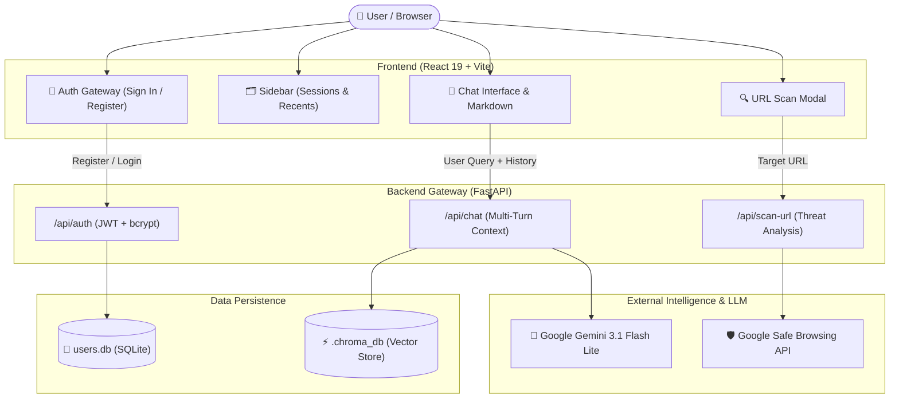

<div align="center">

# 🛡️ CyberSentinel
### *AI-Powered Threat Defense & Cybersecurity Awareness Platform*

[](https://www.python.org/)
[](https://fastapi.tiangolo.com/)
[](https://react.dev/)
[](https://langchain-ai.github.io/langgraph/)
[](https://ai.google.dev/)
[](https://www.sqlite.org/)
[](https://opensource.org/licenses/MIT)

<p align="center">
  <b>CyberSentinel</b> acts as an intelligent first line of defense against online attacks — educating users on phishing, malware, and social engineering while offering real-time threat intelligence scanning and multi-turn conversational guidance.
</p>

[Key Features](#-key-features) •
[Architecture](#-system-architecture) •
[Tech Stack](#-tech-stack) •
[Quick Start](#-quick-start) •
[API Reference](#-api-endpoints) •
[Author](#-author)

---

</div>

## 🚀 Key Features

### 🔐 1. Full-Stack Authentication & Security Gateway
* **Self-Contained SQLite Engine:** Persistent user store with zero external database dependencies.
* **Cryptographic Password Hashing:** Salted hashes generated with `bcrypt` (raw passwords are never stored).
* **JWT Token Authorization:** Signed JSON Web Tokens (HS256) for secure, stateless API session management.
* **Isolated User Sessions:** Each user's conversation history is strictly scoped to their account ID.

### 🗂️ 2. ChatGPT-Style Interactive Sidebar
* **Persistent Session History:** Prior chats are stored and loaded seamlessly from `localStorage`.
* **Smart Auto-Titling:** Conversations are automatically named based on the user's initial inquiry.
* **Multi-Session Management:** Create new chats (`+ New Chat`), switch between historical sessions, or delete individual sessions.
* **Collapsible & Mobile Responsive:** Smooth drawer animation for distraction-free security research.

### 🧠 3. Multi-Turn Conversation Memory (Agentic RAG)
* **LangGraph State Graph:** Retains conversational thread history across multiple query turns.
* **Context Preservation:** Enables natural follow-ups (e.g., asking *"What is ransomware?"* followed by *"Give me 2 real-world examples of it"*).
* **Curated Knowledge Retrieval:** Vector similarity search with Chroma DB to provide verified cybersecurity countermeasures.

### 🔍 4. Real-Time URL Threat Scanner
* **Threat Intelligence Integration:** Cross-references submitted URLs against Google Safe Browsing APIs.
* **Heuristic Engine Fallback:** Flags suspicious TLDs (`.xyz`, `.top`, `.ru`), typosquatting variations of trusted brands, raw IP address URLs, and URL shorteners.
* **Visual Triage Cards:** Displays color-coded risk verdicts (`SAFE`, `SUSPICIOUS`, `MALICIOUS`) with confidence percentages and detected indicators.

### ⚡ 5. High-Speed Model Orchestration
* Powered by Google's **`gemini-3.1-flash-lite`** model, achieving sub-4-second end-to-end response times (~8x faster than traditional reasoning chains).

---

## 🏗️ System Architecture



---

## 🛠️ Tech Stack

| Layer | Technologies Used |
|---|---|
| **Frontend UI** | React 19, Vite, React Markdown, Modern Glassmorphism CSS |
| **Backend API** | FastAPI (Python 3.10+), Uvicorn, Pydantic |
| **AI / Orchestration** | LangGraph, LangChain Core, Google Generative AI |
| **LLM Model** | Google Gemini 3.1 Flash Lite (`gemini-3.1-flash-lite`) |
| **Vector DB (RAG)** | Chroma DB, Google Generative AI Embeddings (`gemini-embedding-2`) |
| **Security & Auth** | PyJWT (HS256), Bcrypt (Salted Hashes), SQLite3 |
| **Threat Intel** | Google Safe Browsing API + Custom Heuristic Analyzer |

---

## 📂 Project Structure

```text
cybersecurity-chatbot/
├── backend/
│   ├── agent/
│   │   ├── auth.py             # SQLite DB, bcrypt hashing & JWT token handling
│   │   ├── graph.py            # LangGraph state machine & LLM agent node
│   │   ├── rag.py              # Chroma vectorstore & document retrieval
│   │   └── scanner.py          # Google Safe Browsing API & heuristic scanner
│   ├── knowledge_base/
│   │   └── data.md             # Security guides (phishing, malware, 2FA, VPNs)
│   ├── main.py                 # FastAPI application, CORS, & API endpoints
│   ├── requirements.txt        # Backend dependencies
│   ├── .env.example            # Environment variable template
│   └── test_setup.py           # Endpoint sanity tests
├── frontend/
│   ├── src/
│   │   ├── App.jsx             # Main chat layout & sidebar session manager
│   │   ├── App.css             # Cyberpunk/dark-themed responsive styling
│   │   ├── AuthModal.jsx       # Login & User Registration gateway modal
│   │   └── main.jsx            # React root mount
│   ├── package.json            # Frontend dependencies
│   └── vite.config.js          # Vite configuration
├── PRD.md                      # Comprehensive Product Requirements Document
├── README.md                   # Project documentation
└── run_project.bat             # 1-Click launcher script for Windows
```

---

## ⚡ Quick Start

### Prerequisites
* **Python 3.10+** installed
* **Node.js 18+** installed
* A free **Google Gemini API Key** ([Get one here](https://aistudio.google.com/))

### 1. Clone the Repository
```bash
git clone https://github.com/Nitya-Patle/CyberSecurity_bot.git
cd CyberSecurity_bot
```

### 2. Configure Environment Variables
Inside the `backend/` directory, create a `.env` file:
```bash
# Windows Powershell
cd backend
Copy-Item .env.example .env
```
Open `.env` and add your API keys:
```env
GOOGLE_API_KEY=your_gemini_api_key_here
SAFE_BROWSING_API_KEY=your_safe_browsing_key_here # Optional: falls back to heuristics
JWT_SECRET_KEY=your_custom_jwt_secret_key_here
```

### 3. One-Click Launch (Windows)
Double-click `run_project.bat` in the project root, or execute:
```cmd
run_project.bat
```

---

### Manual Setup

#### Backend Setup
```bash
cd backend
python -m venv venv
# Windows:
venv\Scripts\activate
# Mac/Linux:
# source venv/bin/activate

pip install -r requirements.txt
python -m uvicorn main:app --reload --port 8001
```
* Backend will be running at `http://localhost:8001` (Interactive Swagger Docs at `http://localhost:8001/docs`).

#### Frontend Setup
```bash
cd frontend
npm install
npm run dev
```
* Frontend will be live at `http://localhost:5173`.

---

## 📡 API Endpoints

### Authentication
| Method | Endpoint | Description | Sample Body |
|---|---|---|---|
| `POST` | `/api/auth/register` | Register new user | `{"name": "Alice", "email": "alice@cyber.org", "password": "Pass"}` |
| `POST` | `/api/auth/login` | Sign in & obtain JWT | `{"email": "alice@cyber.org", "password": "Pass"}` |
| `GET` | `/api/auth/me` | Fetch active user profile | Requires `Authorization: Bearer <token>` |

### Chat & Threat Analysis
| Method | Endpoint | Description | Sample Body |
|---|---|---|---|
| `POST` | `/api/chat` | Send question with history | `{"message": "What is malware?", "history": [...]}` |
| `POST` | `/api/scan-url` | Scan target URL for malware | `{"url": "https://suspicious-login.xyz"}` |
| `GET` | `/api/health` | Service health status | `None` |

---

## 🔒 Security & Privacy Practices

* **No Plaintext Passwords:** Passwords are salted and hashed using standard `bcrypt` before storage.
* **Stateless Tokenization:** Sessions use cryptographically signed JWT tokens with expiration timestamps.
* **Leak Protection:** Confidential environment variables (`.env`), database files (`users.db`), and virtual environments are permanently excluded from source control via `.gitignore`.
* **Zero PII Collection:** The assistant functions as an awareness companion without harvesting sensitive client telemetry.

---

## 👤 Author

**Nitya Purushottam Patle**  
* GitHub: [@Nitya-Patle](https://github.com/Nitya-Patle)  
* Project: CyberSentinel — AI-Powered Cybersecurity First Responder

---

## 📜 License
This project is open-source and available under the [MIT License](LICENSE).

<div align="center">
  <b>⭐ If you find CyberSentinel helpful, please star the repository! ⭐</b>
</div>
